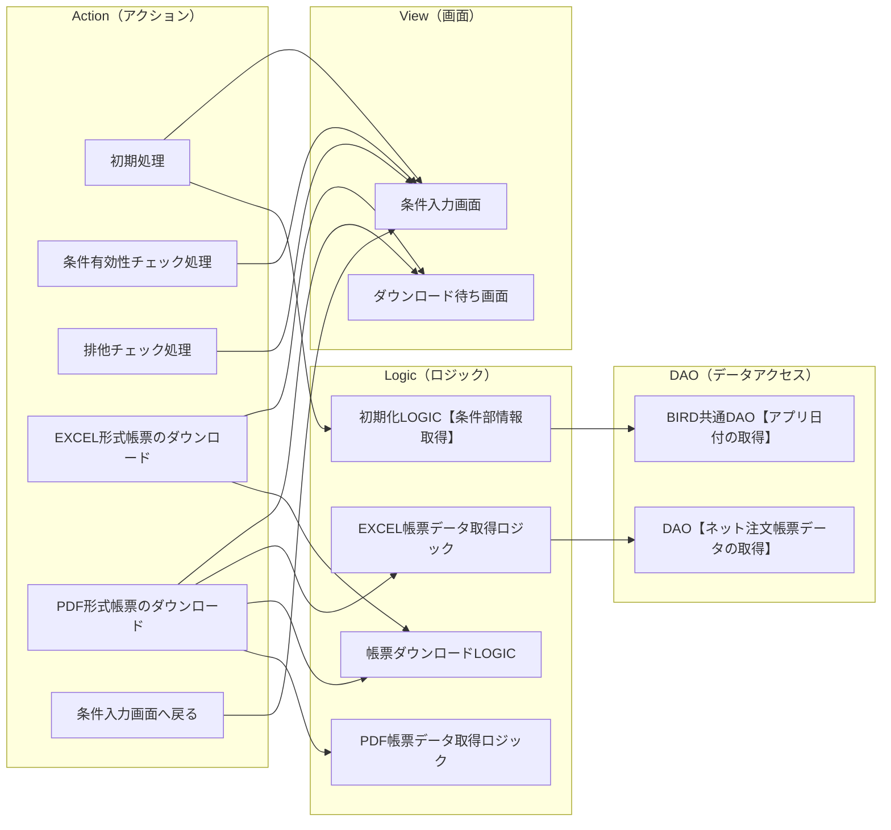

# 概要

**ドキュメント名**: DN-030110-021.02 画面設計書(ネット注文帳票)
**目的**: ネット注文帳票機能の画面設計を定義する
**構成**: 本ドキュメントは以下のセクションで構成されています。
- 更新履歴
- 機能概要
- 画面レイアウト
- 要求仕様
- 画面構成
- アクション
- コンポーネント一覧

# 更新履歴

| BIRD ドキュメント 更新履歴 | BIRD ドキュメント 更新履歴 | BIRD ドキュメント 更新履歴 | BIRD ドキュメント 更新履歴 | BIRD ドキュメント 更新履歴 | BIRD ドキュメント 更新履歴 | BIRD ドキュメント 更新履歴 | BIRD ドキュメント 更新履歴 | BIRD ドキュメント 更新履歴 | BIRD ドキュメント 更新履歴 | BIRD ドキュメント 更新履歴 | BIRD ドキュメント 更新履歴 | BIRD ドキュメント 更新履歴 | BIRD ドキュメント 更新履歴 | BIRD ドキュメント 更新履歴 | BIRD ドキュメント 更新履歴 | BIRD ドキュメント 更新履歴 | BIRD ドキュメント 更新履歴 | BIRD ドキュメント 更新履歴 | BIRD ドキュメント 更新履歴 | BIRD ドキュメント 更新履歴 | BIRD ドキュメント 更新履歴 | BIRD ドキュメント 更新履歴 | BIRD ドキュメント 更新履歴 | BIRD ドキュメント 更新履歴 | BIRD ドキュメント 更新履歴 | BIRD ドキュメント 更新履歴 | BIRD ドキュメント 更新履歴 |
|---|---|---|---|---|---|---|---|---|---|---|---|---|---|---|---|---|---|---|---|---|---|---|---|---|---|---|---|
| BIRD ドキュメント 更新履歴 | BIRD ドキュメント 更新履歴 | BIRD ドキュメント 更新履歴 | BIRD ドキュメント 更新履歴 | BIRD ドキュメント 更新履歴 | BIRD ドキュメント 更新履歴 | BIRD ドキュメント 更新履歴 | BIRD ドキュメント 更新履歴 | BIRD ドキュメント 更新履歴 | BIRD ドキュメント 更新履歴 | BIRD ドキュメント 更新履歴 | BIRD ドキュメント 更新履歴 | BIRD ドキュメント 更新履歴 | BIRD ドキュメント 更新履歴 | BIRD ドキュメント 更新履歴 | BIRD ドキュメント 更新履歴 | BIRD ドキュメント 更新履歴 | BIRD ドキュメント 更新履歴 | BIRD ドキュメント 更新履歴 | BIRD ドキュメント 更新履歴 | BIRD ドキュメント 更新履歴 | BIRD ドキュメント 更新履歴 | BIRD ドキュメント 更新履歴 | BIRD ドキュメント 更新履歴 | BIRD ドキュメント 更新履歴 | BIRD ドキュメント 更新履歴 | BIRD ドキュメント 更新履歴 | BIRD ドキュメント 更新履歴 |
| 作成・更新日 | 作成・更新日 | 作成・更新日 | 更新内容 | 更新内容 | 更新内容 | 更新内容 | 更新内容 | 更新内容 | 更新内容 | 更新内容 | 更新内容 | 更新内容 | 更新内容 | 更新内容 | 更新内容 | 更新内容 | 作成・更新者 | 作成・更新者 | 作成・更新者 | レビュー/承認者 | レビュー/承認者 | レビュー/承認者 | レビュー/承認者 | レビュー/承認日 | レビュー/承認日 | レビュー/承認日 | レビュー/承認日 |
| 2018-06-05 00:00:00 |  |  | 新規作成 |  |  |  |  |  |  |  |  |  |  |  |  |  | 王増文 |  |  | 竹内裕二 |  |  |  | 2018-06-28 00:00:00 |  |  |  |
| 2018-08-28 00:00:00 |  |  | STEP2対応として条件指定、EXCEL/PDFのオンライン作成処理を追加 |  |  |  |  |  |  |  |  |  |  |  |  |  | 竹内裕二 |  |  | 竹内裕二 |  |  |  | 2018-08-28 00:00:00 |  |  |  |
| 2018-09-10 00:00:00 |  |  | アクション処理内容を追加 |  |  |  |  |  |  |  |  |  |  |  |  |  | 王増文 |  |  | 竹内裕二 |  |  |  | 2018-09-10 00:00:00 |  |  |  |

# 機能概要

| 列1 | 列2 | 列3 | 列4 | 列5 | 列6 | 列7 | 列8 | 列9 | 列10 | 列11 | 列12 | 列13 | 列14 | 列15 | 列16 | 列17 |
|---|---|---|---|---|---|---|---|---|---|---|---|---|---|---|---|---|
| [BIRD] | 要求仕様書 |  | 管理番号：DN-030110-021.02 分類　　　：要求仕様書 | 管理番号：DN-030110-021.02 分類　　　：要求仕様書 | 管理番号：DN-030110-021.02 分類　　　：要求仕様書 | 管理番号：DN-030110-021.02 分類　　　：要求仕様書 | 管理番号：DN-030110-021.02 分類　　　：要求仕様書 | 更新者：ISID竹内 更新日：2018/8/28 | 更新者：ISID竹内 更新日：2018/8/28 | 更新者：ISID竹内 更新日：2018/8/28 | 更新者：ISID竹内 更新日：2018/8/28 | 作成者：AO 王増文 作成日：2018/06/05 | 作成者：AO 王増文 作成日：2018/06/05 | 作成者：AO 王増文 作成日：2018/06/05 | 作成者：AO 王増文 作成日：2018/06/05 |  |
| 画面名 |  | ネット注文帳票 |  |  |  |  | フィーチャ | フィーチャ | 業績管理 |  |  |  |  |  |  |  |
| 機能の目的 |  |  |  | 想定ユーザ |  |  |  |  |  |  |  |  |  |  |  |  |
| ネット注文支部別TOP15帳票をダウンロードする。 |  |  |  | 本部ユーザ様 |  |  |  |  |  |  |  |  |  |  |  |  |
| 機能の概要 |  |  |  |  |  |  |  |  |  |  |  |  |  |  |  |  |
| 固定条件前月分出力条件に応じたネット注文支部別TOP15帳票をテキストEXCEL/PDF形式でダウンロードする。 |  |  |  |  |  |  |  |  |  |  |  |  |  |  |  | 8/28変更 |
| 補足説明（用語説明、業務ルールなど） |  |  |  |  |  |  |  |  |  |  |  |  |  |  |  |  |

# 画面レイアウト

### 画面レイアウト

| 列1 | 列2 | 列3 | 列4 | 列5 | 列6 | 列7 | 列8 | 列9 | 列10 | 列11 | 列12 | 列13 | 列14 | 列15 | 列16 | 列17 | 列18 | 列19 | 列20 | 列21 | 列22 |
|---|---|---|---|---|---|---|---|---|---|---|---|---|---|---|---|---|---|---|---|---|---|
| [BIRD] |  | 画面設計書 |  |  |  |  |  |  | 管理番号：DN-030110-021.02 分類　　　：要求仕様書 | 管理番号：DN-030110-021.02 分類　　　：要求仕様書 | 管理番号：DN-030110-021.02 分類　　　：要求仕様書 | 管理番号：DN-030110-021.02 分類　　　：要求仕様書 | 管理番号：DN-030110-021.02 分類　　　：要求仕様書 | 更新者：ISID竹内 更新日：2018/8/28 | 更新者：ISID竹内 更新日：2018/8/28 | 更新者：ISID竹内 更新日：2018/8/28 | 更新者：ISID竹内 更新日：2018/8/28 | 作成者：AO 王増文 作成日：2018/06/05 | 作成者：AO 王増文 作成日：2018/06/05 | 作成者：AO 王増文 作成日：2018/06/05 | 作成者：AO 王増文 作成日：2018/06/05 |
| 画面レイアウト |  |  | 画面ID | BBR019 |  | 画面名 |  | ネット注文帳票 |  |  |  |  |  |  |  |  |  |  |  |  |  |
| ビューID |  | BBR019V01 |  |  | ビュー名 |  | ネット注文帳票 |  |  |  |  |  |  |  |  |  |  | 備考 |  |  |  |
| JSF名 |  | netorderReportForm |  |  | CSS名 |  | body.css |  |  |  |  |  |  |  |  |  |  |  |  |  |  |
|  | 対象期間＝「対象年月」の場合 |  |  |  |  |  |  |  |  |  |  |  |  |  |  |  |  |  |  |  |  |
|  |  |  |  |  |  |  |  |  |  |  |  |  |  |  |  |  |  | ※本部ユーザのみ |  |  |  |
|  | 対象期間＝「期間指定」の場合 |  |  |  |  |  |  |  |  |  |  |  |  |  |  |  |  | ※本部ユーザのみ |  |  |  |
|  | ダウンロードのリンクをクリックした場合、待ち画面を表示する。 |  |  |  |  |  |  |  |  |  |  |  |  |  |  |  |  |  |  |  |  |
|  | ファイルダウンロードした場合、戻るボタンをクリックして、元のダウンロード画面へ戻る。 |  |  |  |  |  |  |  |  |  |  |  |  |  |  |  |  |  |  |  |  |
|  |  |  |  |  |  |  |  |  |  |  |  |  |  |  |  |  |  | ※本部ユーザのみ |  |  |  |

# 要求仕様

**画面名**: 
**フィーチャ**: 業績管理

### 要求仕様一覧

#### FRQ0101: 条件指定による出力

| 項目 | 内容 |
|------|------|
| 要求番号 | FRQ0101 |
| 優先度 | A |
| 要求 | 条件指定（対象期間の「対象年月」「期間指定」）をして出力したい |
| 理由 | 月次での資料作成やキャンペーン時期などのスポット期間での状況把握が必要なため |
| 説明 | 他画面の「対象年月」「期間指定」の仕様を踏襲 |

**仕様 SP010101**

対象期間のプルダウンで「対象年月」「期間指定」を選択させる。選択肢に応じて「期間指定」の内容を年月のリストボックスまたは「対象期間（FROM)」「対象期間（TO）」のリストボックスに動的に切り替えて表示する。

---

#### FRQ0102: 期間指定の制限

| 項目 | 内容 |
|------|------|
| 要求番号 | FRQ0102 |
| 優先度 | A |
| 要求 | パフォーマンス上の問題もあるため期間指定は最長1年間（366日間)としたい |
| 理由 | SQLでの処理が重くなってしまうため |
| 説明 | 期間指定で選択できる最古の期間は他画面を踏襲する |

**仕様 SP010102**

1. 期間指定選択し、EXCELファイル、PDFファイルリンククリック時、最長1年間（366日間）までかチェックを行い、NGの場合は出力画面に戻し、画面上部にメッセージを表示する。
   - メッセージ：「期間指定は最長1年間までとしてください。」
2. 期間指定選択し、EXCELファイル、PDFファイルリンククリック時、FROM<=TOのチェックを行い、NGの場合は出力画面に戻し、画面上部にメッセージを表示する。
   - メッセージ：「期間指定はFROM <= TOでなければなりません。」

---

#### FRQ0103: 出力形式の選択と排他処理

| 項目 | 内容 |
|------|------|
| 要求番号 | FRQ0103 |
| 優先度 | A |
| 要求 | EXCELファイル出力とPDFファイル出力を選択して出力したい。多重実行を避けることができるのでサーバダウンするまでの高負荷は避けられるため、出力時排他処理を実施する。 |
| 理由 | 二次加工も可能であるEXCELファイル出力かスマホなどでの出力・閲覧も意識したPDF出力両方選択できるようにするため |
| 説明 | リンクで出力形式を選んで出力する想定（実装上難しい場合は出力形式を選択して、実行ボタンを押すような形式でも可） |

**仕様 SP010103**

排他チェック処理：
- ロックされた場合：「現在、他のユーザーにて帳票作成中です。しばらく経ってから再度実行してください。」を表示し、帳票出力しない
- ロックされていない場合：ロックファイルを生成し、帳票出力する
- 処理完了したら、ロック解除する

「EXCELファイル」「PDFファイル（表紙）」リンクをクリックした際、下記メッセージを表示した別画面に遷移して各ファイル作成処理を実行する：

> ダウンロードデータの準備をしています。
> そのまましばらくお待ち下さい。
> ダウンロード完了後、下記のボタンを押して下さい。
> 【戻る】

---

#### FRQ0104: ファイル名への条件反映

| 項目 | 内容 |
|------|------|
| 要求番号 | FRQ0104 |
| 優先度 | A |
| 要求 | 出力したファイル名から出力した条件が分かるようにしたい |
| 理由 | 後でどのような条件で出力したものか分かるようにするため |
| 説明 | - |

**仕様 SP010104**

ファイル名は以下の通り、条件を付ける：
- 対象年月の場合：`ネット注文支部別TOP15_YYYYMM.xlsx(pdf)`
- 期間指定の場合：`ネット注文支部別TOP15_YYYYMMDD-YYYYMMDD.xlsx(pdf)`

---

#### FRQ0105: データ出力先シートと順位パターン

| 項目 | 内容 |
|------|------|
| 要求番号 | FRQ0105 |
| 優先度 | A |
| 要求 | 取得したデータをEXCELの決まったシートに張り付ける。また順位について支部CD順と支部取込CD順2パターンほしい。 |
| 理由 | 支部CD、支部取込CD順になるようテンプレートEXCEL上で数式をあらかじめ組んでいるため |
| 説明 | - |

**仕様 SP010105**

SQL上のorder byを張り付けるシートによって切り替えて2回実行し、2つのシートにデータを張り付ける：
- dataシート張り付けの場合：`1,3,5,7,9`
- data_area_daiシート張り付けの場合：`7,9`

※データは各シートのJ5セルから張り付ける

# 画面構成

### 基本情報

| 項目 | 内容 |
|------|------|
| 画面ID | BBR019 |
| 画面名 | ネット注文帳票 |
| 機能概要 |  |
| パッケージルート |  |
| 画面タイプ | 検索エンジン型 |

### 使用テーブル

- BM45ZDAY（前年営業日情報）
- BM11ONER（グループ統合オーナマスタ）
- BM01TENM（店統合マスタ）
- BM10GSIB（汎用店舗グループ（支部））
- BT63SNIP（営業日報（日次））
- BM82NOJT(ネット注文帳票除外店舗マスタ)

### コンポーネント構成図

> 元の図はExcelファイルの「画面構成」シートを参照してください。

# アクション

### アクション定義

| 列1 | 列2 | 列3 | 列4 | 列5 | 列6 | 列7 | 列8 | 列9 | 列10 | 列11 | 列12 | 列13 | 列14 | 列15 | 列16 | 列17 | 列18 | 列19 | 列20 |
|---|---|---|---|---|---|---|---|---|---|---|---|---|---|---|---|---|---|---|---|
|  |  |  |  |  |  |  |  |  |  |  | 更新者：AO王増文 更新日：2018/9/10 | 更新者：AO王増文 更新日：2018/9/10 | 更新者：AO王増文 更新日：2018/9/10 | 更新者：AO王増文 更新日：2018/9/10 | 作成者：AO 王増文 作成日：2018/06/05 | 作成者：AO 王増文 作成日：2018/06/05 | 作成者：AO 王増文 作成日：2018/06/05 | 作成者：AO 王増文 作成日：2018/06/05 | 作成者：AO 王増文 作成日：2018/06/05 |
| アクション |  | 画面ID |  |  | 画面名 |  | ネット注文帳票 |  |  |  |  |  |  |  |  |  |  |  |  |
| ビュー名 | ネット注文帳票画面 |  |  |  |  |  |  |  |  |  |  |  |  |  |  |  |  |  |  |
| アクションID | BBR019A01 |  | アクション名 | 初期処理 |  |  |  |  |  | 遷移先ビュー |  |  | 呼出し元（null） |  |  |  |  |  |  |
| 事前条件 |  |  |  |  |  | 処理概要 |  |  |  |  |  |  |  |  |  |  |  |  |  |
| ログインユーザが【ネット注文帳票】機能のアクセス権限を持っていること |  |  |  |  |  | １．プルダウンメニューから遷移された場合、下記の処理を行います。 |  |  |  |  |  |  |  |  |  |  |  |  |  |
|  |  |  |  |  |  |  | 1.BIRD共通DTO【メニュープルダウン情報】.クリアフラグへfalseを設定します。 |  |  |  |  |  |  |  |  |  |  |  |  |
|  |  |  |  |  |  |  | 2.日報共通LOGIC【条件部情報取得】.実行を実行します。 |  |  |  |  |  |  |  |  |  |  |  |  |
|  |  |  |  |  |  |  |  | 引数： | CTRL【BIRDログインユーザー情報】.[ユーザー情報].ユーザータイプコード |  |  |  |  |  |  |  |  |  |  |
|  |  |  |  |  |  |  |  |  | CTRL【BIRDログインユーザー情報】.ユーザーＩＤ |  |  |  |  |  |  |  |  |  |  |
|  |  |  |  |  |  |  |  |  | CTRL【BIRD日付情報】.アプリ日付 |  |  |  |  |  |  |  |  |  |  |
|  |  |  |  |  |  |  | 3.ネット注文帳票DTO【条件部情報】.CTRL【BIRD日付情報】へコンテナから取得したCTRL【BIRD日付情報】を設定します。 |  |  |  |  |  |  |  |  |  |  |  |  |
|  |  |  |  |  |  |  | 4.ネット注文帳票DTO【条件部情報】.CTRL【BIRDログインユーザー情報】へコンテナから |  |  |  |  |  |  |  |  |  |  |  |  |
|  |  |  |  |  |  |  |  | 取得したCTRL【BIRDログインユーザー情報】を設定します。 |  |  |  |  |  |  |  |  |  |  |  |
|  |  |  |  |  |  |  | 5.ネット注文帳票DTO【条件部情報】.条件情報設定を実行し、戻り値windowIdを取得します。 |  |  |  |  |  |  |  |  |  |  |  |  |
|  |  |  |  |  |  |  | 6.ネット注文帳票DTO【検索条件】.ウィンドウIDへ処理5の戻り値windowIdを設定します。 |  |  |  |  |  |  |  |  |  |  |  |  |
|  |  |  |  |  |  |  | 7.ネット注文帳票DTO【検索条件】へデフォルト値を設定します。 |  |  |  |  |  |  |  |  |  |  |  |  |
| 事後条件 |  |  |  |  |  |  |  |  |  |  |  |  |  |  |  |  |  |  |  |
| 自画面へ遷移する。 |  |  |  |  |  | ２．nullをリターンします。(現行画面へ遷移) |  |  |  |  |  |  |  |  |  |  |  |  |  |
| アクションID | BBR019A02_01 |  | アクション名 | 画面入力したパラメータチェック処理 |  |  |  |  |  | 遷移先ビュー |  |  | 呼出し元（null） |  |  |  |  |  |  |
| 事前条件 |  |  |  |  |  | 処理概要 |  |  |  |  |  |  |  |  |  |  |  |  |  |
| 条件入力画面で入力され、ダウンロードリンクをクリックされる。 |  |  |  |  |  | 画面上に、対象期間に「期間指定」は選択された場合、下記チェック処理実行する。 |  |  |  |  |  |  |  |  |  |  |  |  |  |
|  |  |  |  |  |  |  | 「対象年月」は選択された場合、チェックOKとして、次の排他チェック処理へ。 |  |  |  |  |  |  |  |  |  |  |  |  |
|  |  |  |  |  |  | １．.期間指定FROM > 期間指定TO |  |  |  |  |  |  |  |  |  |  |  |  |  |
|  |  |  |  |  |  |  | 期間指定選択し、期間指定FROM > 期間指定TOの場合、チェックエラーで、条件入力画面へ戻る。 |  |  |  |  |  |  |  |  |  |  |  |  |
|  |  |  |  |  |  |  | 画面上部に、ワーニングメッセージ表示する。 |  |  |  |  |  |  |  |  |  |  |  |  |
|  |  |  |  |  |  |  |  | 「期間指定はFROM <= TOでなければなりません。」 |  |  |  |  |  |  |  |  |  |  |  |
|  |  |  |  |  |  | ２．期間１年間以上指定 |  |  |  |  |  |  |  |  |  |  |  |  |  |
| 事後条件 |  |  |  |  |  |  | 期間指定選択し、EXCELファイル、最長1年間（366日間）超えた場合、チェックエラーで、条件入力画面へ戻る。 |  |  |  |  |  |  |  |  |  |  |  |  |
| 正常終了時及びエラー時は、自画面へ遷移する。 |  |  |  |  |  |  | 画面上部に、ワーニングメッセージ表示する。 |  |  |  |  |  |  |  |  |  |  |  |  |
|  |  |  |  |  |  |  |  | 「期間指定は最長1年間までとしてください。」 |  |  |  |  |  |  |  |  |  |  |  |
|  |  |  |  |  |  | ３．チェックOKの場合、 |  |  |  |  |  |  |  |  |  |  |  |  |  |
|  |  |  |  |  |  |  | 次の排他チェック処理へ。 |  |  |  |  |  |  |  |  |  |  |  |  |
| アクションID | BBR019A02_02 |  | アクション名 | 排他処理 |  |  |  |  |  | 遷移先ビュー |  |  | 呼出し元（null） |  |  |  |  |  |  |
| 事前条件 |  |  |  |  |  | 処理概要 |  |  |  |  |  |  |  |  |  |  |  |  |  |
| 条件入力画面で入力され、ダウンロードリンクをクリックされる。 |  |  |  |  |  | １．指定フォルダ以下にnet_oerder.lockファイルが存在していないか確認する。 |  |  |  |  |  |  |  |  |  |  |  |  |  |
| 画面入力したパラメータチェックOKでした。 |  |  |  |  |  |  | ※指定フォルダは、/data1/bird/netorder　（共通クラスで、プロパティ定義ファイルから取得） |  |  |  |  |  |  |  |  |  |  |  |  |
|  |  |  |  |  |  |  | １－１． | net_oerder.lockファイルが存在しない場合、net_oerder.lockファイルを作成し、ロック掛ける。排他処理チェックOKとする。 |  |  |  |  |  |  |  |  |  |  |  |
|  |  |  |  |  |  |  | １－２． | net_oerder.lockファイルが存在しタイムスタンプが5分以上経過していた場合、 |  |  |  |  |  |  |  |  |  |  |  |
|  |  |  |  |  |  |  |  | 不正にファイルが残ってしまっているものと判断し、net_oerder.lockファイルを削除する。 |  |  |  |  |  |  |  |  |  |  |  |
|  |  |  |  |  |  |  |  | net_oerder.lockファイルを再作成する、ロックをかける。　排他チェック処理OKとする。 |  |  |  |  |  |  |  |  |  |  |  |
| 事後条件 |  |  |  |  |  |  |  |  |  |  |  |  |  |  |  |  |  |  |  |
| 正常終了時及びエラー時は、自画面へ遷移する。 |  |  |  |  |  |  | １－３． | net_oerder.lockファイルが存在しタイムスタンプが5分未満の場合、以下エラーメッセージを実行画面上部に表示する。 |  |  |  |  |  |  |  |  |  |  |  |
|  |  |  |  |  |  |  |  | 「現在、他のユーザーにて帳票作成中です。しばらく経ってから再度実行してください。」 |  |  |  |  |  |  |  |  |  |  |  |
|  |  |  |  |  |  | ２．チェックOKの場合、 |  |  |  |  |  |  |  |  |  |  |  |  |  |
|  |  |  |  |  |  |  | ネット注文帳票検索条件DTOで、検索処理を実行し、帳票生成ダウンロード処理を実行する。 |  |  |  |  |  |  |  |  |  |  |  |  |
| アクションID | BBR019A03 |  | アクション名 | EXCELダウンロード |  |  |  |  |  | 遷移先ビュー |  |  | 呼出し元（null） |  |  |  |  |  |  |
| 事前条件 |  |  |  |  |  | 処理概要 |  |  |  |  |  |  |  |  |  |  |  |  |  |
| 有効な条件を入力されたこと。 |  |  |  |  |  | １．ネット注文帳票データを取得する |  |  |  |  |  |  |  |  |  |  |  |  |  |
|  |  |  |  |  |  |  | ネット注文帳票DTO【検索条件】にて、NetOrderReportExcelLogicをコールし、ネット注文データを取得する。 |  |  |  |  |  |  |  |  |  |  |  |  |
|  |  |  |  |  |  | ２．テープレートより、データセットし、EXCEL帳票を生成する。 |  |  |  |  |  |  |  |  |  |  |  |  |  |
|  |  |  |  |  |  |  | １－１．テンプレートファイル：　「ネット注文支部別TOP15.xlsx」 |  |  |  |  |  |  |  |  |  |  |  |  |
|  |  |  |  |  |  |  |  | ※指定フォルダは、/data1/bird/netorder　（共通クラスで、プロパティ定義ファイルから取得） |  |  |  |  |  |  |  |  |  |  |  |
|  |  |  |  |  |  |  | １－２．BBR019L03ロジックをコールし、EXCEL帳票生成する。 |  |  |  |  |  |  |  |  |  |  |  |  |
| 事後条件 |  |  |  |  |  |  |  |  |  |  |  |  |  |  |  |  |  |  |  |
| 正常終了時及びエラー時は、自画面へ遷移する。 |  |  |  |  |  |  |  |  |  |  |  |  |  |  |  |  |  |  |  |
|  |  |  |  |  |  | ３．EXCELファイルのダウンロードを行う。 |  |  |  |  |  |  |  |  |  |  |  |  |  |
|  |  |  |  |  |  |  | ３－１．ダウンロードファイル名： |  |  |  |  |  |  |  |  |  |  |  |  |
|  |  |  |  |  |  |  |  | 対象期間に「対象年月」は選択された場合、　「ネット注文支部別TOP15_YYYYMM.xlsx」 |  |  |  |  |  |  |  |  |  |  |  |
|  |  |  |  |  |  |  |  | 対象期間に「期間指定」は選択された場合、　「ネット注文支部別TOP15_YYYYMMDD-YYYYMMDD.xlsx」 |  |  |  |  |  |  |  |  |  |  |  |
|  |  |  |  |  |  | ４．ロックファイルnet_oerder.lockを削除するにより、ロック解除する。 |  |  |  |  |  |  |  |  |  |  |  |  |  |
| アクションID | BBR019A04 |  | アクション名 | PDFダウンロード |  |  |  |  |  | 遷移先ビュー |  |  | 呼出し元（null） |  |  |  |  |  |  |
| 事前条件 |  |  |  |  |  | 処理概要 |  |  |  |  |  |  |  |  |  |  |  |  |  |
| 有効な条件を入力されたこと。 |  |  |  |  |  | １．ネット注文帳票データを取得する |  |  |  |  |  |  |  |  |  |  |  |  |  |
|  |  |  |  |  |  |  | ネット注文帳票DTO【検索条件】にて、NetOrderReportExcelLogicをコールし、ネット注文データを取得する。 |  |  |  |  |  |  |  |  |  |  |  |  |
|  |  |  |  |  |  |  | ※ソート順 7,9 のデータを取得しない。 |  |  |  |  |  |  |  |  |  |  |  |  |
|  |  |  |  |  |  | ２．テープレートより、データセットし、一時のEXCEL帳票を生成する。 |  |  |  |  |  |  |  |  |  |  |  |  |  |
|  |  |  |  |  |  |  | １－１．テンプレートファイル：　「ネット注文支部別TOP15_PDF.xlsx」 |  |  |  |  |  |  |  |  |  |  |  |  |
|  |  |  |  |  |  |  |  | ※指定フォルダは、/data1/bird/netorder　（共通クラスで、プロパティ定義ファイルから取得） |  |  |  |  |  |  |  |  |  |  |  |
| 事後条件 |  |  |  |  |  |  | １－２．BBR019L03ロジックをコールし、temp_excel2pdf.xlsxEXCEL帳票生成する。 |  |  |  |  |  |  |  |  |  |  |  |  |
| 正常終了時及びエラー時は、自画面へ遷移する。 |  |  |  |  |  |  |  |  |  |  |  |  |  |  |  |  |  |  |  |
|  |  |  |  |  |  |  | １－３．JODConverter＋LibreOfficeで、EXCELからPDFへ変換処理する |  |  |  |  |  |  |  |  |  |  |  |  |
|  |  |  |  |  |  |  |  | temp_excel2pdf.xlsx　⇒　temp_excel2pdf.pdf |  |  |  |  |  |  |  |  |  |  |  |
|  |  |  |  |  |  | ３．PDFファイルのダウンロードを行う。 |  |  |  |  |  |  |  |  |  |  |  |  |  |
|  |  |  |  |  |  |  | ３－１．ダウンロードファイル名： |  |  |  |  |  |  |  |  |  |  |  |  |
|  |  |  |  |  |  |  |  | 対象期間に「対象年月」は選択された場合、　「ネット注文支部別TOP15_YYYYMM.pdf」 |  |  |  |  |  |  |  |  |  |  |  |
|  |  |  |  |  |  |  |  | 対象期間に「期間指定」は選択された場合、　「ネット注文支部別TOP15_YYYYMMDD-YYYYMMDD.pdf」 |  |  |  |  |  |  |  |  |  |  |  |
|  |  |  |  |  |  | ４．ロックファイルnet_oerder.lockを削除するにより、ロック解除する。 |  |  |  |  |  |  |  |  |  |  |  |  |  |
| アクションID | BBR019A05 |  | アクション名 | 戻る |  |  |  |  |  | 遷移先ビュー |  |  | 呼出し元（null） |  |  |  |  |  |  |
| 事前条件 |  |  |  |  |  | 処理概要 |  |  |  |  |  |  |  |  |  |  |  |  |  |
| 帳票ダウンロード完了したこと。 |  |  |  |  |  | １．条件入力画面へ遷移する。 |  |  |  |  |  |  |  |  |  |  |  |  |  |
| 事後条件 |  |  |  |  |  |  |  |  |  |  |  |  |  |  |  |  |  |  |  |
| 正常終了時及びエラー時は、条件入力画面へ遷移する。 |  |  |  |  |  |  |  |  |  |  |  |  |  |  |  |  |  |  |  |

# コンポーネント一覧

**画面ID**: BBR019
**画面名**: ネット注文帳票

### コンポーネント一覧

| 項目名 | 編集 | 表示 | データタイプ | 桁数 | コントロール | 初期値 | 必須 | 対応プロパティ・アクション | 備考 |
|---|---|---|---|---|---|---|---|---|---|
| 条件エリア |  |  |  |  |  |  |  |  |  |
| 対象期間 | × | ○ | 文字列 |  | プルダウン | 対象年月 | ○ |  |  |
| 期間指定 | × | ○ | 日付文字列(文字列) |  | プルダウン | 当月 | ○ |  | 対象期間＝「対象年月」の時、表示し、入力可能 |
| 期間指定FROM | × | ○ | 日付文字列(文字列) |  | プルダウン | アプリ日付 | ○ |  | 対象期間＝「期間指定」の時、表示し、入力可能 |
| 期間指定TO | × | ○ | 日付文字列(文字列) |  | プルダウン | アプリ日付 | ○ |  | 対象期間＝「期間指定」の時、表示し、入力可能 |
| EXCELリンク | × | ○ |  |  | リンク |  | ○ | アクション【EXCELダウンロード】を実行する。 |  |
| PDFファイル(表紙) | × | ○ |  |  | リンク |  | ○ | アクション【PDFダウンロード】を実行する。 |  |

# 読み取りが難しかった項目

- 図形変換メトリクス：図形14個、コネクタ14本（うち接続先不明1本）
- 結合セルのレイアウトが完全に再現できなかった箇所がある可能性があります
- 一部のセルで複数行テキストが含まれており、改行が タグに変換されています
- アクションシートの処理詳細は一部省略されている可能性があります

# 不明点・不明瞭な点

- 画面構成図の一部のコネクタの接続先が不明確な箇所があります
- 要求仕様の一部の項目で「優先」「分類」列が空欄になっている箇所があり、意図的な省略か記載漏れか不明です
- アクション定義の「遷移先ビュー」「呼出し元」の一部が空欄になっています
- コンポーネント一覧の「対応プロパティ・アクション」列が空欄の項目があります
