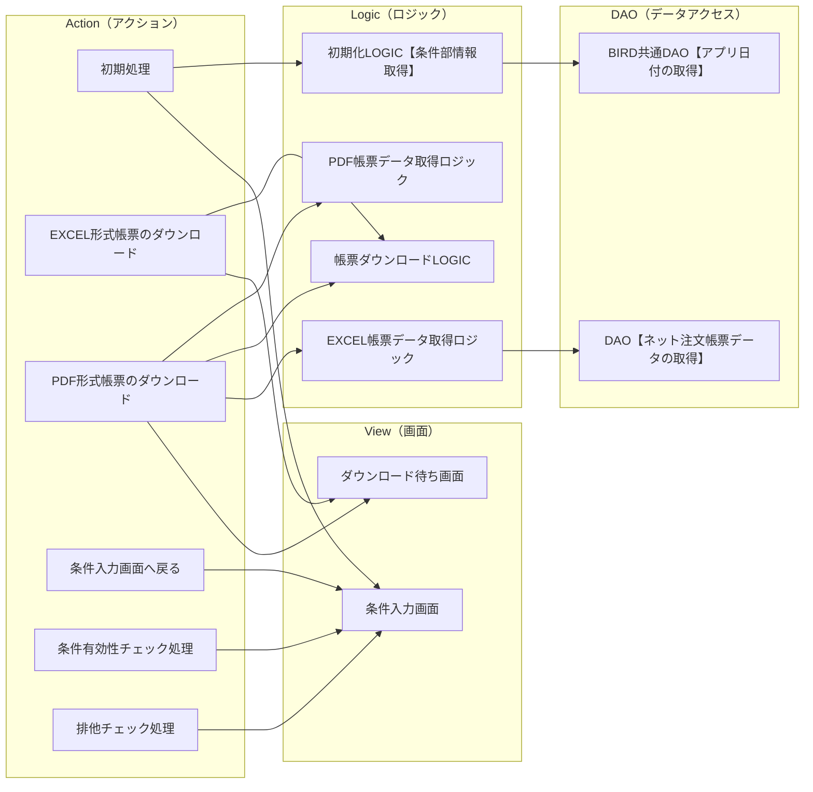

# 概要

**ドキュメント名**: DN-030110-021.02 画面設計書(ネット注文帳票)
**目的**: ネット注文帳票機能の画面設計を定義する
**構成**: 本ドキュメントは以下のセクションで構成されています。
- 更新履歴
- 機能概要
- 画面レイアウト
- 要求仕様
- 画面構成
- アクション
- コンポーネント一覧

# 更新履歴

### 承認履歴

| 作成・更新日 | 更新内容 | 作成・更新者 | レビュー/承認者 | レビュー/承認日 |
|---|---|---|---|---|
| 2018-06-05 | 新規作成 | 王増文 | 竹内裕二 | 2018-06-28 |
| 2018-08-28 | STEP2対応として条件指定、EXCEL/PDFのオンライン作成処理を追加 | 竹内裕二 | 竹内裕二 | 2018-08-28 |
| 2018-09-10 | アクション処理内容を追加 | 王増文 | 竹内裕二 | 2018-09-10 |

# 機能概要

### 基本情報

| 項目 | 内容 |
|------|------|
| 画面名 | ネット注文帳票 |
| フィーチャ | 業績管理 |
| 機能の目的 | ネット注文支部別TOP15帳票をダウンロードする |
| 想定ユーザ | 本部ユーザ様 |

### 機能の概要

固定条件前月分出力条件に応じたネット注文支部別TOP15帳票をEXCEL/PDF形式でダウンロードする。

# 画面レイアウト

### 画面レイアウト

### 画面情報

| 項目 | 内容 |
|------|------|
| 画面ID | BBR019 |
| 画面名 | ネット注文帳票 |
| ビューID | BBR019V01 |
| ビュー名 | ネット注文帳票 |
| JSF名 | netorderReportForm |
| CSS名 | body.css |

### 画面動作説明

- 対象期間＝「対象年月」の場合：年月のリストボックスを表示
- 対象期間＝「期間指定」の場合：「対象期間（FROM)」「対象期間（TO）」のリストボックスを表示
- ダウンロードのリンクをクリックした場合、待ち画面を表示する
- ファイルダウンロードした場合、戻るボタンをクリックして、元のダウンロード画面へ戻る
- ※本部ユーザのみ利用可能

# 要求仕様

**画面名**: ネット注文帳票
**フィーチャ**: 業績管理

### 要求仕様一覧

#### FRQ0101: 条件指定による出力

| 項目 | 内容 |
|------|------|
| 要求番号 | FRQ0101 |
| 優先度 | A |
| 要求 | 条件指定（対象期間の「対象年月」「期間指定」）をして出力したい |
| 理由 | 月次での資料作成やキャンペーン時期などのスポット期間での状況把握が必要なため |
| 説明 | 他画面の「対象年月」「期間指定」の仕様を踏襲 |

**仕様 SP010101**

対象期間のプルダウンで「対象年月」「期間指定」を選択させる。選択肢に応じて「期間指定」の内容を年月のリストボックスまたは「対象期間（FROM)」「対象期間（TO）」のリストボックスに動的に切り替えて表示する。

---

#### FRQ0102: 期間指定の制限

| 項目 | 内容 |
|------|------|
| 要求番号 | FRQ0102 |
| 優先度 | A |
| 要求 | パフォーマンス上の問題もあるため期間指定は最長1年間（366日間)としたい |
| 理由 | SQLでの処理が重くなってしまうため |
| 説明 | 期間指定で選択できる最古の期間は他画面を踏襲する |

**仕様 SP010102**

1. 期間指定選択し、EXCELファイル、PDFファイルリンククリック時、最長1年間（366日間）までかチェックを行い、NGの場合は出力画面に戻し、画面上部にメッセージを表示する。
   - メッセージ：「期間指定は最長1年間までとしてください。」
2. 期間指定選択し、EXCELファイル、PDFファイルリンククリック時、FROM<=TOのチェックを行い、NGの場合は出力画面に戻し、画面上部にメッセージを表示する。
   - メッセージ：「期間指定はFROM <= TOでなければなりません。」

---

#### FRQ0103: 出力形式の選択と排他処理

| 項目 | 内容 |
|------|------|
| 要求番号 | FRQ0103 |
| 優先度 | A |
| 要求 | EXCELファイル出力とPDFファイル出力を選択して出力したい。多重実行を避けることができるのでサーバダウンするまでの高負荷は避けられるため、出力時排他処理を実施する。 |
| 理由 | 二次加工も可能であるEXCELファイル出力かスマホなどでの出力・閲覧も意識したPDF出力両方選択できるようにするため |
| 説明 | リンクで出力形式を選んで出力する想定（実装上難しい場合は出力形式を選択して、実行ボタンを押すような形式でも可） |

**仕様 SP010103**

排他チェック処理：
- ロックされた場合：「現在、他のユーザーにて帳票作成中です。しばらく経ってから再度実行してください。」を表示し、帳票出力しない
- ロックされていない場合：ロックファイルを生成し、帳票出力する
- 処理完了したら、ロック解除する

「EXCELファイル」「PDFファイル（表紙）」リンクをクリックした際、下記メッセージを表示した別画面に遷移して各ファイル作成処理を実行する：

> ダウンロードデータの準備をしています。
> そのまましばらくお待ち下さい。
> ダウンロード完了後、下記のボタンを押して下さい。
> 【戻る】

---

#### FRQ0104: ファイル名への条件反映

| 項目 | 内容 |
|------|------|
| 要求番号 | FRQ0104 |
| 優先度 | A |
| 要求 | 出力したファイル名から出力した条件が分かるようにしたい |
| 理由 | 後でどのような条件で出力したものか分かるようにするため |
| 説明 | - |

**仕様 SP010104**

ファイル名は以下の通り、条件を付ける：
- 対象年月の場合：ネット注文支部別TOP15_YYYYMM.xlsx(pdf)
- 期間指定の場合：ネット注文支部別TOP15_YYYYMMDD-YYYYMMDD.xlsx(pdf)

---

#### FRQ0105: データ出力先シートと順位パターン

| 項目 | 内容 |
|------|------|
| 要求番号 | FRQ0105 |
| 優先度 | A |
| 要求 | 取得したデータをEXCELの決まったシートに張り付ける。また順位について支部CD順と支部取込CD順2パターンほしい。 |
| 理由 | 支部CD、支部取込CD順になるようテンプレートEXCEL上で数式をあらかじめ組んでいるため |
| 説明 | - |

**仕様 SP010105**

SQL上のorder byを張り付けるシートによって切り替えて2回実行し、2つのシートにデータを張り付ける：
- dataシート張り付けの場合：1,3,5,7,9
- data_area_daiシート張り付けの場合：7,9

※データは各シートのJ5セルから張り付ける

# 画面構成

### 基本情報

| 項目 | 内容 |
|------|------|
| 画面ID | BBR019 |
| 画面名 | ネット注文帳票 |
| 機能概要 | ネット注文帳票のダウンロードを行う |
| パッケージルート | - |
| 画面タイプ | 検索エンジン型 |

### 使用テーブル

- BM45ZDAY（前年営業日情報）
- BM11ONER（グループ統合オーナマスタ）
- BM01TENM（店統合マスタ）
- BM10GSIB（汎用店舗グループ（支部））
- BT63SNIP（営業日報（日次））
- BM82NOJT（ネット注文帳票除外店舗マスタ）

### コンポーネント構成図

> 元の図はExcelファイルの「画面構成」シートを参照してください。

# アクション

### アクション定義

| アクションID | アクション名 | 概要 |
|---|---|---|
| BBR019A01 | 初期処理 | プルダウンメニューから遷移された場合の初期化処理 |
| BBR019A02 | 条件有効性チェック処理 | 入力条件の妥当性をチェック |
| BBR019A03 | 排他チェック処理 | 帳票出力の排他制御 |
| BBR019A04 | EXCEL形式帳票のダウンロード | EXCEL形式で帳票をダウンロード |
| BBR019A05 | PDF形式帳票のダウンロード | PDF形式で帳票をダウンロード |
| BBR019A06 | 条件入力画面へ戻る | ダウンロード待ち画面から条件入力画面へ戻る |

### アクション詳細

#### BBR019A01: 初期処理

**事前条件**: ログインユーザが【ネット注文帳票】機能のアクセス権限を持っていること

**処理概要**:
1. BIRD共通DTO【メニュープルダウン情報】.クリアフラグへfalseを設定
2. 日報共通LOGIC【条件部情報取得】.実行を実行
3. ネット注文帳票DTO【条件部情報】にCTRL【BIRD日付情報】を設定
4. ネット注文帳票DTO【条件部情報】にCTRL【BIRDログインユーザー情報】を設定
5. 条件情報設定を実行し、戻り値windowIdを取得

#### BBR019A02: 条件有効性チェック処理

**事前条件**: 条件入力画面で条件が入力されていること

**処理概要**:
1. 対象期間の選択値をチェック
2. 期間指定の場合、FROM <= TO のチェック
3. 期間指定の場合、最長1年間（366日間）のチェック
4. エラーがある場合はメッセージを設定して条件入力画面へ戻る

#### BBR019A03: 排他チェック処理

**事前条件**: 条件有効性チェックが完了していること

**処理概要**:
1. ロックファイルの存在をチェック
2. ロックされている場合はエラーメッセージを設定して条件入力画面へ戻る
3. ロックされていない場合はロックファイルを生成

#### BBR019A04: EXCEL形式帳票のダウンロード

**事前条件**: 排他チェックが完了していること

**処理概要**:
1. ダウンロード待ち画面を表示
2. 帳票ダウンロードLOGICを呼び出し
3. EXCEL帳票データ取得ロジックを実行
4. テンプレートEXCELにデータを設定
5. EXCELファイルをダウンロード
6. ロックを解除

#### BBR019A05: PDF形式帳票のダウンロード

**事前条件**: 排他チェックが完了していること

**処理概要**:
1. ダウンロード待ち画面を表示
2. 帳票ダウンロードLOGICを呼び出し
3. PDF帳票データ取得ロジックを実行
4. PDFファイルを生成
5. PDFファイルをダウンロード
6. ロックを解除

#### BBR019A06: 条件入力画面へ戻る

**事前条件**: ダウンロード待ち画面が表示されていること

**処理概要**:
1. 条件入力画面へ遷移

# コンポーネント一覧

### コンポーネント一覧

| コンポーネントID | コンポーネント名 | 種別 | 説明 |
|---|---|---|---|
| BBR019V01 | ネット注文帳票画面 | View | 条件入力・ダウンロード画面 |
| BBR019A01 | 初期処理 | Action | 画面初期化処理 |
| BBR019A02 | 条件有効性チェック処理 | Action | 入力チェック |
| BBR019A03 | 排他チェック処理 | Action | 排他制御 |
| BBR019A04 | EXCEL形式帳票のダウンロード | Action | EXCEL出力 |
| BBR019A05 | PDF形式帳票のダウンロード | Action | PDF出力 |
| BBR019A06 | 条件入力画面へ戻る | Action | 画面遷移 |
| BBR019L01 | 初期化LOGIC【条件部情報取得】 | Logic | 条件部の初期化 |
| BBR019L02 | 帳票ダウンロードLOGIC | Logic | 帳票出力制御 |
| BBR019L03 | EXCEL帳票データ取得ロジック | Logic | EXCELデータ取得 |
| BBR019L04 | PDF帳票データ取得ロジック | Logic | PDFデータ取得 |
| BBR019D01 | BIRD共通DAO【アプリ日付の取得】 | DAO | 日付取得 |
| BBR019D02 | DAO【ネット注文帳票データの取得】 | DAO | 帳票データ取得 |

# 読み取りが難しかった項目

- 図形変換メトリクス：図形14個、コネクタ14本（うち接続先不明1本）
- アクションシートの詳細な処理フローは複雑なレイアウトのため一部簡略化して記載
- コンポーネント一覧シートの一部データが数式参照のため値が取得できなかった箇所あり
- 結合セルが多用されているため、一部のレイアウトが完全に再現できていない可能性がある

# 不明点・不明瞭な点

- アクションシートの処理詳細について、一部の処理フローが省略されている可能性がある
- コンポーネント一覧の完全なリストがExcelから抽出できなかった可能性がある
- 画面レイアウトの画像が複数存在するが、どの画像がどの状態を示すか不明確
- 使用テーブルの詳細な用途説明が元のExcelに記載されていない
