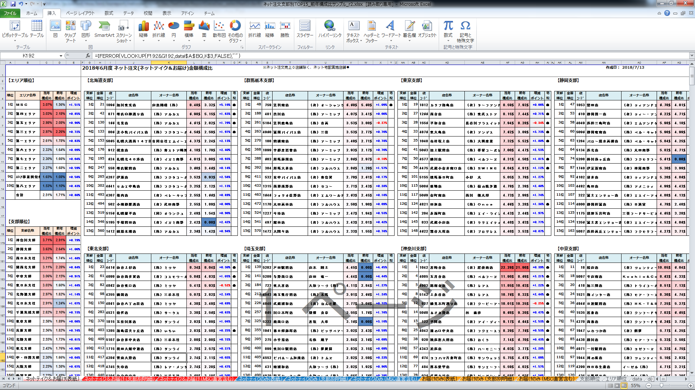

# DN-030110-021.01 帳票レイアウト設計書（ネット注文帳票）

## 概要

このドキュメントは「DN-030110-021.01 帳票レイアウト設計書（ネット注文帳票）」に関する設計書です。帳票のレイアウト設計情報を含んでいます。

含まれるシート: 変更履歴, EXCEL帳票, PDF帳票の元テンプレート

## 文書情報

| 項目 | 内容 |
|------|------|
| 管理番号 | DN-030110-021.01 |
| 分類 | 帳票レイアウト設計書 |
| 作成者 |  |
| 作成日 |  |
| 更新者 |  |
| 更新日 |  |

## 更新履歴

| 列1 | 列2 | 列3 | 列4 | 列5 | 列6 | 列7 | 列8 | 列9 |
|------|------|------|------|------|------|------|------|------|
|  | バージョン | 変更管理NO | 担当者 | 日付 | 担当者 | 日付 | 担当者 | 日付 |
|  | 1 | ネット注文帳票 | 王増文 | 2018-09-06 00:00:00 | 田村雄一 | 2018-09-06 00:00:00 | 竹内裕二 | 2018-09-06 00:00:00 |
|  | 変更履歴 |  |  |  |  |  |  |  |
|  | バージョン | 変更内容 | 変更内容 | 変更内容 | 変更内容 | 変更内容 | 変更内容 | 変更内容 |
|  | 1 | 新規作成 | 新規作成 | 新規作成 | 新規作成 | 新規作成 | 新規作成 | 新規作成 |

---

## 変更履歴

| 承認履歴 |  |  |  |  |  |  |  |
|------|------|------|------|------|------|------|------|
| バージョン | 変更管理NO | 作成 | 作成 | レビュー | レビュー | 承認 | 承認 |
| バージョン | 変更管理NO | 担当者 | 日付 | 担当者 | 日付 | 担当者 | 日付 |
| 1 | ネット注文帳票 | 王増文 | 2018-09-06 00:00:00 | 田村雄一 | 2018-09-06 00:00:00 | 竹内裕二 | 2018-09-06 00:00:00 |
| 変更履歴 |  |  |  |  |  |  |  |
| バージョン | 変更内容 | 変更内容 | 変更内容 | 変更内容 | 変更内容 | 変更内容 | 変更内容 |
| 1 | 新規作成 | 新規作成 | 新規作成 | 新規作成 | 新規作成 | 新規作成 | 新規作成 |

---

## EXCEL帳票

### 図

| 参照ファイル： |  |
|------|------|
|  | ..\..\..\..\..\[P]Project\V_2018年度\02_ネット注文支部別TOP15\04_詳細設計\STEP2\帳票ファイル\ネット注文支部別TOP15_前年構成比サンプル_r2.xlsx |

---

## PDF帳票の元テンプレート

### 図

| 参照ファイル： |  |
|------|------|
|  | ..\..\..\..\..\[P]Project\V_2018年度\02_ネット注文支部別TOP15\04_詳細設計\STEP2\帳票ファイル\ネット注文支部別TOP15_PDF.xlsx |

---

## 読み取りが難しかった項目

- 特になし

## 不明点・不明瞭な点

- 特になし
