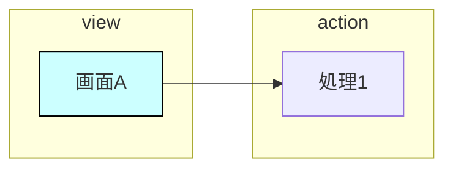
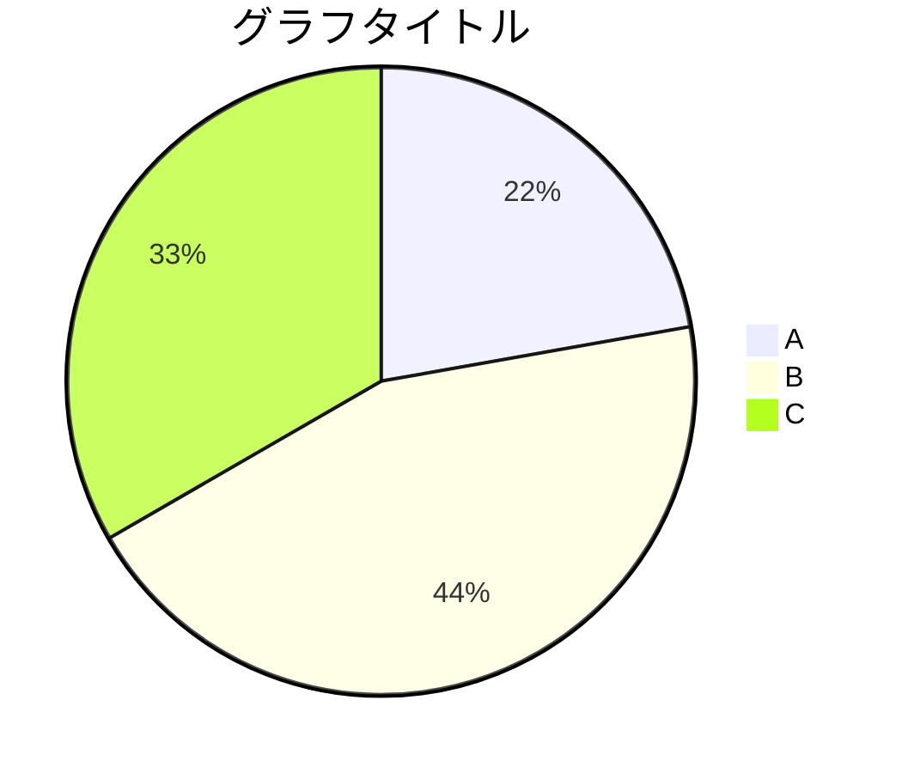

# Excelファイルをマークダウンに変換

## Overview

Excelファイル（.xls/.xlsx）の内容を読み取り、概要とシートごとのセクションで構成されたマークダウンファイルを作成する。テキスト、表形式のデータ、および画像を対象とする。

## What's Needed From User

- 変換対象のExcelファイルのパス
  - 例：`Migration/Documents/ネット注文帳票/DN-030110-021.02 業務ロジック設計書(ネット注文帳票).xls`

## Procedure

1. 対象のExcelファイルの存在と拡張子（.xls または .xlsx）を確認する
2. Pythonライブラリをインストールする：`python3 -m pip install pandas xlrd openpyxl pillow`
3. Pythonスクリプトで全シートを読み取る
   - 全シート読み取り：`pandas.read_excel(file, sheet_name=None, engine=...)`
   - `.xls`形式：`engine="xlrd"`
   - `.xlsx`形式：`engine="openpyxl"`
   - `sheet_name=None`を指定することで全シートを辞書形式で取得
4. 結合セルを適切に処理する（下記「結合セルの処理」参照）
5. ヘッダー行の重複を整理する（下記「ヘッダー行の整理」参照）
6. シート内の画像を抽出・解析する（下記「画像の処理」参照）
7. 各シートの内容をマークダウン形式に変換する
   - ロジック設計書テンプレートの場合：下記「ロジック設計書テンプレートの変換」に従ってセクション抽出を行う
   - 一般的な表形式のデータはマークダウンテーブルに変換
   - 表以外のレイアウト文章は行順に段落として出力
8. 概要セクションを作成する（ドキュメント全体の内容を要約）
9. 文書情報セクションを作成する（下記「文書情報セクションの構成」参照）
10. シートごとのセクションを作成する（シート名をヘッダーとして使用）
11. 「読み取りが難しかった項目」セクションを作成する（下記「読み取りが難しかった項目の記載」参照）
12. 「不明点・不明瞭な点」セクションを作成する（下記「不明点・不明瞭な点の記載」参照）
13. 出力ファイルを元のExcelファイルと同じディレクトリに保存する
    - ファイル名：元のファイル名の拡張子を`.md`に変更
    - 例：`DN-030110-021.02 業務ロジック設計書(ネット注文帳票).xls` → `DN-030110-021.02 業務ロジック設計書(ネット注文帳票).md`
14. 生成したマークダウンファイルを検証する
    - Excelのシート名一覧とマークダウン内のセクション名が一致すること
    - シート数が一致すること
    - 表がマークダウンテーブル形式（`|`区切り）になっていること

## Specifications

### 出力フォーマット

```markdown
# [ドキュメントタイトル（ファイル名から取得）]

## 概要

[ドキュメント全体の内容を要約した概要を記載。どのような目的の文書か、主要な内容は何か、含まれるシートの概要などを簡潔に説明する]

## 文書情報

| 項目 | 内容 |
|------|------|
| 管理番号 | [管理番号] |
| 分類 | [分類] |
| 作成者 | [作成者] |
| 作成日 | [作成日] |
| 更新者 | [更新者] |
| 更新日 | [更新日] |

## 更新履歴

| 作成・更新日 | 更新内容 | 作成・更新者 | レビュー/承認者 | レビュー/承認日 |
|--------------|----------|--------------|-----------------|-----------------|
| [日付] | [内容] | [担当者] | [レビュー者] | [日付] |

---

## [シート名1]

[シート1の内容]

---

## [シート名2]

[シート2の内容]

---

## 読み取りが難しかった項目

[Excel変換時に読み取りが困難だった項目や情報が失われた可能性がある項目を記載。以下のような項目を含める：
- 画像の抽出ができなかった場合（特に.xls形式）
- 結合セルのレイアウトが完全に再現できなかった箇所
- 数式セルで計算結果が取得できなかった箇所
- 文字化けが発生した箇所
- 複雑なレイアウトで情報が欠落した可能性がある箇所]

## 不明点・不明瞭な点

[仕様として不明確または追加の確認が必要な点を記載。以下のような項目を含める：
- 空欄になっている項目で、意図的な省略か記載漏れか不明な箇所
- 用語や略語の意味が不明確な箇所
- 仕様の記載が曖昧で複数の解釈が可能な箇所
- 関連する他の文書への参照が不明確な箇所]
```

### 文書情報セクションの構成

文書情報には以下の項目を含める（Excelファイルから取得できる場合）：
- 管理番号
- 分類（設計書の種類：Dao設計書、業務ロジック設計書、画面設計書など）
- 作成者・作成日
- 更新者・更新日

情報の取得元：
- 「更新履歴」「変更履歴」などの名前のシートがあれば優先的に参照
- ファイル名から管理番号を抽出（例：`DN-030110-021.02`）
- 各シートのヘッダー部分

### 結合セルの処理

ファイル形式に応じて結合セルを適切に処理する：

**.xlsx形式の場合（openpyxl使用）：**

```python
from openpyxl import load_workbook

wb = load_workbook(file_path)
for sheet in wb.worksheets:
    # 結合セルの範囲を取得
    merged_ranges = list(sheet.merged_cells.ranges)
    
    for merged_range in merged_ranges:
        # 結合セルの左上の値を取得
        top_left_cell = sheet.cell(merged_range.min_row, merged_range.min_col)
        top_left_value = top_left_cell.value
        
        # 結合を解除
        sheet.unmerge_cells(str(merged_range))
        
        # 結合範囲内のすべてのセルに左上の値を設定
        for row in range(merged_range.min_row, merged_range.max_row + 1):
            for col in range(merged_range.min_col, merged_range.max_col + 1):
                sheet.cell(row, col).value = top_left_value
```

**.xls形式の場合（xlrd使用）：**

```python
import xlrd

wb = xlrd.open_workbook(file_path, formatting_info=True)
for sheet in wb.sheets():
    # 結合セルの範囲を取得（(row_lo, row_hi, col_lo, col_hi)のタプル）
    merged_cells = sheet.merged_cells
    
    # 結合セルのマップを作成
    merged_map = {}
    for (rlo, rhi, clo, chi) in merged_cells:
        value = sheet.cell(rlo, clo).value
        for r in range(rlo, rhi):
            for c in range(clo, chi):
                merged_map[(r, c)] = value
```

### ヘッダー行の整理

結合セルを展開した後、ヘッダー行に同じ値が繰り返される場合がある。これを適切に整理する：

1. **重複の検出**：ヘッダー行の各セルを確認し、連続して同じ値が繰り返されているかチェック
2. **重複の除去**：同じ値が連続している場合、最初の1つだけを残し、残りは空文字に置換
3. **意味のあるヘッダーの特定**：シート名やドキュメントタイトルがヘッダー行全体に展開されている場合、それをセクションタイトルとして使用し、実際のデータヘッダーは次の行から取得

```python
def clean_header_row(row_data):
    """ヘッダー行の重複を整理する"""
    cleaned = []
    prev_value = None
    for value in row_data:
        if value == prev_value:
            cleaned.append("")  # 重複は空文字に
        else:
            cleaned.append(value)
            prev_value = value
    return cleaned

def find_actual_header_row(data, sheet_name):
    """実際のヘッダー行を特定する"""
    for i, row in enumerate(data):
        # シート名の繰り返しでない行を探す
        unique_values = set(v for v in row if v)
        if len(unique_values) > 1 or (len(unique_values) == 1 and sheet_name not in unique_values):
            return i
    return 0
```

### ロジック設計書テンプレートの変換

ロジック設計書（業務ロジック設計書など）は、特定のテンプレート構造を持つ。このようなドキュメントは、単純なテーブル変換ではなく、セクション抽出を行って構造化された出力を生成する。

#### テンプレートの検出

以下の条件を**複数満たす**場合、ロジック設計書テンプレートとして処理する（過剰適用を避けるため）：
- シート名に「ロジック」「Logic」「BBR」などのキーワードが含まれる
- セル内に「機能概要」「ロジッククラス」「インタフェース定義」「処理内容」などの見出し語が**複数**存在する

#### ロジックNO/ロジック名の確定

出力の見出しは `## BBR019L01: 検索条件初期化データ取得` の形式にする：

1. **ロジックNO**：
   - 「ロジックNO」セルの値を最優先
   - なければシート名や見出し（`【BBR019L01】`）から正規表現 `BBR\d+L\d+` で抽出

2. **ロジック名**：
   - シート名の `【BBRxxxx】` 以降の部分を優先（例：`【BBR019L01】検索条件初期化データ取得` → `検索条件初期化データ取得`）
   - なければ表中の `LOGIC【...】` 行から抽出
   - `【】` や `LOGIC` は出力から除去

#### セクション構造

各ロジックシートは以下のセクションに分解して出力する：

```markdown
## [ロジックNO]: [ロジック名]

### 基本情報

| 項目 | 内容 |
|------|------|
| 機能概要 | [値] |
| ロジッククラス | [値] |
| ロジックNO | [値] |
| ステータス | [値] |
| TX属性 | [値] |

### インタフェース定義

#### パラメータ

| 項目名 | データタイプ | 内容 | 必須 | 初期値 |
|--------|--------------|------|------|--------|
| [項目名] | [型] | [内容] | [必須] | [初期値] |

#### リターン

| 項目名 | データタイプ | 内容 | 初期値 |
|--------|--------------|------|--------|
| [項目名] | [型] | [内容] | [初期値] |

### データI/O定義

| 使用Dao名 | Daoクラス名 |
|-----------|-------------|
| [Dao名] | [クラス名] |

### その他importクラス

| クラス名 | パッケージ |
|----------|------------|
| [クラス名] | [パッケージ] |

### コントラクト定義

#### 事前条件

| 条件 | メッセージID（引数） |
|------|----------------------|
| [条件] | [メッセージID] |

#### 事後条件

| 条件 | メッセージID（引数） |
|------|----------------------|
| [条件] | [メッセージID] |

### ロジック定義

#### 処理内容

1. **[処理タイトル]**
   - [詳細説明]
   - `[コード/定数]`

2. **[処理タイトル]**
   - [詳細説明]
```

#### セクション抽出ルール

1. **見出し語の検出**：左端列付近に以下の見出し語が出現したら、新しいセクションの開始とみなす
   - `機能概要`、`ロジッククラス`、`ロジックNO`、`ステータス`、`TX属性`
   - `インタフェース定義`、`パラメータ`、`リターン`
   - `データI/O定義`、`使用Dao名`
   - `その他importクラス`
   - `コントラクト定義`、`事前条件`、`事後条件`
   - `ロジック定義`、`処理内容`

2. **基本情報の抽出**：以下の項目をキーとして値を抽出し、2列テーブルに整形
   - 機能概要、ロジッククラス、ロジックNO、ステータス、TX属性
   - 帳票ヘッダ（`[BIRD]ロジック設計書`、管理番号、作成者等）は基本情報に含めない

3. **テーブルセクションの抽出**：`項目名`、`データタイプ`等の列名がある行を検出し、ヘッダ付きテーブルとして抽出
   - 次のセクション見出しが出るまで、または空行が3行以上連続するまでをテーブル範囲とする
   - **列名マッピング**：列位置ではなく列名で対応付けし、期待列に正規化する
     - パラメータ: `項目名 | データタイプ | 内容 | 必須 | 初期値`
     - リターン: `項目名 | データタイプ | 内容 | 初期値`
     - データI/O定義: `使用Dao名 | Daoクラス名`
     - その他importクラス: `クラス名 | パッケージ`
     - コントラクト定義: `条件 | メッセージID（引数）`
   - 存在しない列は `-` で埋め、装飾用の空列は無視する

4. **処理内容の抽出**：番号付きの行は番号付きリストに変換
   - 番号表記は `1.`、`１．`、`1)`、`１）` など揺れを許容
   - 番号と本文が同一セルの場合も、別セルの場合も対応
   - 番号行の直後の説明行は箇条書きでぶら下げる
   - 定数表現（`{MONTH, "対象年月"}`等）はインラインコードで保持

5. **見出し語の表記ゆれ許容**：以下の表記ゆれは同一として扱う
   - `データI/O定義` = `データIO定義`
   - `その他importクラス` = `その他 import クラス`
   - 部分一致でも検出可（例：「インタフェース」を含む行は「インタフェース定義」として扱う）

#### 前処理

セクション抽出の前に以下の前処理を行う：
- 全列が空の列を削除
- 全行が空の行を削除
- 右端の空列をトリム
- 「ステータスリスト」などのサイド欄（暫定版/レビュー待ち/確定版のリスト）は無視

#### フォールバック

セクション抽出に失敗した場合（見出し語が検出できない等）：
- 従来通りテーブルとして出力
- 「読み取りが難しかった項目」に「セクション抽出に失敗したため、元のテーブル形式で出力」と記載

### 画像の処理

シート内の画像を抽出し、内容を解析してマークダウンに変換する。ファイル形式によって対応方法が異なる：

#### .xlsx形式の場合

##### 埋め込み画像の抽出

openpyxlの`_images`属性を使用してシート内の埋め込み画像を取得できる：

```python
from openpyxl import load_workbook

wb = load_workbook(file_path)
for sheet in wb.worksheets:
    for image in sheet._images:
        # 画像データを取得
        image_data = image._data()
        # 画像の位置情報を取得
        anchor = image.anchor
        # 画像を解析してマークダウンに変換
```

##### 図形（DrawingML）の抽出とMermaid変換

Excelで作成された図形（フローチャート、アーキテクチャ図など）は、`_images`属性では取得できない。これらはDrawingML形式でxlsxファイル内に格納されている。以下の手順で抽出・変換する：

1. **xlsxファイルをZIPとして展開し、drawingファイルを特定**：
   ```python
   import zipfile
   import xml.etree.ElementTree as ET
   
   with zipfile.ZipFile(file_path, 'r') as z:
       # xl/drawings/ 内のdrawingX.xmlファイルを確認
       drawing_files = [f for f in z.namelist() if f.startswith('xl/drawings/drawing') and f.endswith('.xml')]
       
       # シートとdrawingの対応関係を確認（xl/worksheets/_rels/sheetX.xml.rels）
       for drawing_file in drawing_files:
           drawing_content = z.read(drawing_file).decode('utf-8')
           root = ET.fromstring(drawing_content)
   ```

2. **図形（shapes）とコネクタ（connectors）を抽出**：
   ```python
   ns = {
       'xdr': 'http://schemas.openxmlformats.org/drawingml/2006/spreadsheetDrawing',
       'a': 'http://schemas.openxmlformats.org/drawingml/2006/main'
   }
   
   shapes = {}
   shape_positions = {}
   shape_colors = {}
   
   for anchor in root.findall('.//xdr:twoCellAnchor', ns):
       sp = anchor.find('.//xdr:sp', ns)
       if sp is not None:
           nvSpPr = sp.find('.//xdr:nvSpPr', ns)
           cNvPr = nvSpPr.find('.//xdr:cNvPr', ns) if nvSpPr else None
           if cNvPr is not None:
               shape_id = cNvPr.get('id')
               
               # 位置情報を取得
               xfrm = sp.find('.//a:xfrm', ns)
               if xfrm is not None:
                   off = xfrm.find('a:off', ns)
                   if off is not None:
                       shape_positions[shape_id] = int(off.get('x', 0))
               
               # テキストを取得
               text_parts = [t.text for t in sp.findall('.//a:t', ns) if t.text]
               text = ''.join(text_parts).strip()
               
               # 塗りつぶし色を取得
               solidFill = sp.find('.//a:solidFill/a:srgbClr', ns)
               color = solidFill.get('val') if solidFill is not None else None
               
               if text:
                   shapes[shape_id] = text
                   shape_colors[shape_id] = color
   ```

3. **コネクタ（接続線）を抽出**：
   ```python
   connections = []
   incomplete_connectors = []  # 接続先不明のコネクタを記録
   
   for anchor in root.findall('.//xdr:twoCellAnchor', ns):
       cxnSp = anchor.find('.//xdr:cxnSp', ns)
       if cxnSp is not None:
           nvCxnSpPr = cxnSp.find('.//xdr:nvCxnSpPr', ns)
           cNvCxnSpPr = nvCxnSpPr.find('.//xdr:cNvCxnSpPr', ns)
           stCxn = cNvCxnSpPr.find('.//a:stCxn', ns)
           endCxn = cNvCxnSpPr.find('.//a:endCxn', ns)
           
           # コネクタIDを取得（ログ用）
           cNvPr = nvCxnSpPr.find('.//xdr:cNvPr', ns) if nvCxnSpPr else None
           connector_id = cNvPr.get('id') if cNvPr is not None else 'unknown'
           
           # 接続先が不完全なコネクタを記録
           if stCxn is None or endCxn is None:
               incomplete_connectors.append({
                   'connector_id': connector_id,
                   'has_start': stCxn is not None,
                   'has_end': endCxn is not None
               })
               continue
           
           from_id = stCxn.get('id')
           to_id = endCxn.get('id')
           
           # 線の色を取得
           ln = cxnSp.find('.//a:ln', ns)
           line_color = None
           if ln is not None:
               ln_solidFill = ln.find('a:solidFill/a:srgbClr', ns)
               if ln_solidFill is not None:
                   line_color = ln_solidFill.get('val')
           
           connections.append({
               'from_id': from_id,
               'to_id': to_id,
               'from_text': shapes.get(from_id, f"Unknown({from_id})"),
               'to_text': shapes.get(to_id, f"Unknown({to_id})"),
               'line_color': line_color
           })
   
   # 変換品質メトリクスを記録
   conversion_metrics = {
       'total_shapes': len(shapes),
       'total_connectors': len(connections) + len(incomplete_connectors),
       'valid_connectors': len(connections),
       'incomplete_connectors': len(incomplete_connectors)
   }
   ```

4. **Mermaid形式に変換**：
   - 図形のX座標でグループ化し、subgraphとして配置
   - 色情報からclassDefでスタイルを定義
   - コネクタ情報から矢印を生成
   - 接続先不明のコネクタがある場合は「読み取りが難しかった項目」に記載

**注意事項（矢印の向き）**：
- DrawingMLの`stCxn`/`endCxn`は必ずしも視覚的な矢印の向きと一致しない
- `a:xfrm`の`flipH`/`flipV`属性、`a:headEnd`/`a:tailEnd`の矢印設定を確認する
- 図形のX座標を比較し、左から右へのフローを基本として向きを推定する
- 変換結果は必ず元の図と照合して検証する

**接続先不明のコネクタの処理**：
- `stCxn`または`endCxn`がNoneのコネクタは、図形の接続点に結び付いていない（近くに置いてあるだけ）か、グループ化・別要素参照などでID解決できないケース
- これらのコネクタはMermaid出力から除外し、「読み取りが難しかった項目」に「接続先不明のコネクタがX本ありました」と記載する
- 変換品質メトリクス（図形数、コネクタ数、接続先不明のコネクタ数）も併記する

#### .xls形式の場合

xlrdライブラリでは画像・図形の抽出がサポートされていない。以下のいずれかの方法で対応する：

1. **LibreOfficeを使用して.xlsxに変換してから抽出**：
   ```bash
   libreoffice --headless --convert-to xlsx --outdir /tmp input.xls
   ```
   変換後のファイルから上記の方法で図形・画像を抽出する。

2. **抽出ができない場合の対応**：
   - 「読み取りが難しかった項目」セクションに「.xls形式のため図形/画像の抽出ができませんでした」と記載
   - 可能であれば、元のExcelファイルを目視で確認し、図の内容をテキストで説明

#### 画像の解析とマークダウンへの出力

抽出した画像は以下の優先順位で処理する：

**優先順位1: DrawingMLからMermaid形式に変換（xlsxの図形の場合）**

xlsxファイル内の図形（DrawingML）は、上記「図形（DrawingML）の抽出とMermaid変換」の手順でMermaid形式に変換する。

図の種類に応じて適切なMermaid構文を選択する：

| 図の種類 | Mermaid構文 | 例 |
|----------|-------------|-----|
| フローチャート | `flowchart LR` または `flowchart TD` | 処理フロー、業務フロー、画面構成図 |
| シーケンス図 | `sequenceDiagram` | API呼び出し、画面遷移 |
| ER図 | `erDiagram` | データベース設計 |
| 円グラフ | `pie` | 割合表示 |
| 状態遷移図 | `stateDiagram-v2` | ステータス遷移 |
| アーキテクチャ図 | `flowchart LR` + `subgraph` | View/Action/Logic/DAO構成図 |

Mermaid変換の出力形式：
```markdown
### 図: [図の説明]



> 元の図はExcelファイルの「[シート名]」シートを参照してください。
```

**Mermaid変換が失敗した場合のフォールバック**：
- DrawingMLの解析でエラーが発生した場合、または矢印の向きが正しく判定できない場合は、優先順位2（画像として抽出）に移行する
- 変換結果が元の図と大きく異なる場合も、画像として抽出する方法を優先する

**注意事項：**
- Mermaid化した場合も、検証用に元のExcelファイルへの参照を併記する
- 矢印の向きや分岐条件の誤りが発生する可能性があるため、変換結果を元の図と照合して確認する
- Mermaidの対応範囲は閲覧環境依存（GitHub/VSCode等）のため、複雑な図は画像参照を優先

**優先順位2: 画像ファイルとして保存・参照（Mermaid変換が困難な場合）**

Mermaid変換が困難な場合、または変換に失敗した場合は、画像を抽出してファイルとして保存し、マークダウンから参照する：

1. **保存先ディレクトリ**：
   - `{元ファイル名}_assets/images/`
   - 例：`DN-030110-021.02 業務ロジック設計書(ネット注文帳票)_assets/images/`

2. **ファイル名規則**：
   - `{シート名}_img_{連番}.png`
   - シート名に `/` などファイル名に使えない文字が含まれる場合はアンダースコアに置換
   - 例：`BBR019L01_img_1.png`

3. **マークダウンでの参照形式**：
   ```markdown
   ### 図: [図の説明]
   
   ![図: [図の説明]](./{元ファイル名}_assets/images/{シート名}_img_{連番}.png)
   
   [図の内容を簡潔に説明するテキスト]
   ```

4. **代替テキスト（alt）の記載**：
   - 画像の内容を簡潔に説明する代替テキストを必ず含める
   - 検索性向上のため、図に含まれる主要な要素を記載

**画像抽出の方法**：
- **埋め込み画像**：openpyxlの`_images`属性から取得
- **図形のスクリーンショット**：DrawingMLから画像として抽出できない場合は、Excelファイルを開いて該当シートのスクリーンショットを取得

#### 画像の種類判定と説明文の生成

抽出した画像は、その位置と内容に基づいて種類を判定し、適切な説明文を生成する：

##### 画像の種類判定

1. **ヘッダーロゴ/装飾画像**：
   - 判定条件：画像の位置が行0〜2、列20以降（右上隅）にある小さな画像
   - 処理：マークダウンへの出力をスキップする（ドキュメントの本質的な内容ではないため）

2. **画面キャプチャ（スクリーンショット）**：
   - 判定条件：「画面レイアウト」「画面設計」などのシート名、または画像の前後に画面に関する説明文がある
   - 説明文の形式：`![画面キャプチャN: [説明]]`
   - 例：``

3. **図表・ダイアグラム**：
   - 判定条件：「構成図」「フロー」「遷移図」などのシート名、または図形を含む画像
   - 説明文の形式：`![図N: [説明]]`
   - 例：``

4. **その他の画像**：
   - 判定条件：上記に該当しない画像
   - 説明文の形式：`![図N: [シート名]の図](./images/{シート名}.png)`

##### 複数画像の番号付けルール

シート内に複数の画像がある場合、以下のルールで番号を付ける：

1. **番号付けの形式**：
   - 画面キャプチャの場合：`画面キャプチャ1`、`画面キャプチャ2`、...
   - 図表の場合：`図1`、`図2`、...
   - ヘッダーロゴはカウントから除外する

2. **マークダウンでの参照形式**：
   ```markdown
   
   
   
   
   
   ```

##### 説明文の抽出方法

画像の説明文は、以下の優先順位で抽出する：

1. **画像の直前の行のテキスト**：
   - 画像のアンカー位置（開始行）の1〜3行前にあるテキストを確認
   - 説明的なテキスト（例：「対象期間＝「対象年月」の場合」）があれば、それを説明文として使用

2. **シート名からの推測**：
   - シート名に含まれるキーワードから画像の種類を推測
   - 例：「画面レイアウト」→ 画面キャプチャ、「画面構成」→ 構成図

3. **デフォルトの説明文**：
   - 上記で説明文が取得できない場合は、シート名をそのまま使用
   - 例：``

##### 画像説明文抽出のPythonコード例

```python
def get_image_description(sheet, image, image_index, total_images):
    """画像の説明文を生成する"""
    anchor = image.anchor
    start_row = anchor._from.row if hasattr(anchor, '_from') else 0
    start_col = anchor._from.col if hasattr(anchor, '_from') else 0
    
    # ヘッダーロゴの判定（右上隅の小さな画像）
    if start_row <= 2 and start_col >= 20:
        return None  # スキップ
    
    # 画像の種類を判定
    sheet_name = sheet.title
    is_screen_capture = any(kw in sheet_name for kw in ['画面レイアウト', '画面設計', 'レイアウト'])
    
    # 直前の行からテキストを抽出
    description = None
    for r in range(max(0, start_row - 3), start_row):
        for c in range(0, 25):
            cell = sheet.cell(row=r + 1, column=c + 1)
            if cell.value and isinstance(cell.value, str) and len(cell.value) > 3:
                description = cell.value.strip()
                break
        if description:
            break
    
    # 番号付け
    if total_images > 1:
        if is_screen_capture:
            prefix = f"画面キャプチャ{image_index}"
        else:
            prefix = f"図{image_index}"
    else:
        if is_screen_capture:
            prefix = "画面キャプチャ"
        else:
            prefix = "図"
    
    # 説明文の生成
    if description:
        return f"{prefix}: {description}"
    else:
        return f"{prefix}: {sheet_name}"
```

**優先順位3: 図の解析ができなかった場合（マークダウンへの埋め込み指示）**

画像抽出自体ができない場合、または図の内容を解析できない場合は、以下の対応を行う：

1. **マークダウンに図の存在を明記**：
   ```markdown
   ### 図: [シート名]の図
   
   > ⚠️ この図はExcelファイルから自動抽出できませんでした。
   > 元のExcelファイル「[ファイル名]」の「[シート名]」シートを参照してください。
   
   **図の概要**：
   - 図の種類：[フローチャート/アーキテクチャ図/etc.]
   - 含まれる要素：[主要な要素のリスト]
   - 図の目的：[図が説明している内容]
   ```

2. **「読み取りが難しかった項目」セクションに詳細を記載**：
   - 画像が存在するシート名と位置（行/列の目安）
   - 抽出できなかった理由（.xls形式、図形オブジェクト、DrawingML解析エラー等）
   - 可能であれば、元のExcelファイルを目視で確認した内容の説明

3. **ユーザーへの対応依頼**：
   - 図の内容が重要な場合は、ユーザーに手動でスクリーンショットを取得してもらうよう依頼する旨を記載

**Excelチャート（グラフオブジェクト）の場合**

Excelのチャートオブジェクト（棒グラフ、折れ線グラフ等）は、画像認識より元データを抽出する方が確実：

1. チャートの元データ（系列・カテゴリ）をマークダウン表として出力
2. 可能であればMermaidの `pie` や `xychart-beta` に変換
3. 複雑なチャートは画像として保存・参照

```markdown
### グラフ: [グラフのタイトル]

| カテゴリ | 値 |
|----------|-----|
| A | 100 |
| B | 200 |
| C | 150 |


```

### 読み取りが難しかった項目の記載

Excel変換時に読み取りが困難だった項目や情報が失われた可能性がある項目を必ず記載する。以下のような項目を含める：

- **.xls形式での画像抽出不可**：xlrdライブラリでは画像抽出がサポートされていないため、.xls形式のファイルでは画像を抽出できない場合がある
- **結合セルのレイアウト再現**：結合セルを展開した結果、元のレイアウトが完全に再現できなかった箇所
- **数式セルの計算結果**：数式セルでキャッシュされた計算結果が取得できなかった箇所
- **文字化け**：エンコーディングの問題で文字化けが発生した箇所
- **複雑なレイアウト**：複数のテーブルが混在するなど、複雑なレイアウトで情報が欠落した可能性がある箇所
- **日付データの変換**：Excelのシリアル値から日付への変換が不確実な箇所
- **接続先不明のコネクタ**：DrawingML図形変換時に、接続先が特定できなかったコネクタがある場合は、その本数と変換品質メトリクス（図形数、コネクタ数）を記載する。例：「図形変換メトリクス：図形12個、コネクタ15本（うち接続先不明2本）」

### 不明点・不明瞭な点の記載

仕様として不明確または追加の確認が必要な点を必ず記載する。以下のような項目を含める：

- **空欄の項目**：意図的な省略か記載漏れか不明な空欄
- **用語・略語**：意味が不明確な用語や略語
- **曖昧な仕様**：複数の解釈が可能な仕様記載
- **不完全な参照**：関連する他の文書への参照が不明確な箇所
- **矛盾する記載**：文書内で矛盾している可能性がある箇所

### 成功条件

- すべてのシートがマークダウンファイルに含まれている
- 表形式のデータはマークダウンのテーブル形式で表現されている
- 結合セルが適切に処理され、データが欠落していない
- シート内の画像が解析され、マークダウンの図として記載されている
- 日本語が正しく表示されている
- 出力ファイルが元のファイルと同じディレクトリに保存されている
- 「読み取りが難しかった項目」セクションが含まれている
- 「不明点・不明瞭な点」セクションが含まれている

## Advice and Pointers

- **ファイル形式の違い**：.xls形式はxlrd、.xlsx形式はopenpyxlを使用する。それぞれのライブラリで結合セルや画像の扱いが異なるため注意
- **結合セル**：結合セルの範囲を取得し、左上セルの値を全セルに設定する。pandasのread_excelだけでは結合セルの値が正しく取得できない場合がある
- **ヘッダー行の重複**：結合セルを展開すると、ヘッダー行に同じ値が繰り返されることがある。重複を検出して整理し、意味のあるヘッダー行を特定する
- **空シート**：セクションは作成し、「内容なし」と記載する
- **数式セル**：キャッシュされた計算結果を取得する。未計算の場合はその旨を「読み取りが難しかった項目」セクションに記載する
- **1シート内に複数テーブル**：表ブロックごとに`###`見出しで区切る
- **画像・図（.xlsx）**：埋め込み画像はopenpyxlの`_images`属性で抽出。図形（フローチャート等）はDrawingML（xl/drawings/drawingX.xml）を解析してMermaid形式に変換する。変換困難な場合は画像ファイルとして保存・参照する
- **画像・図（.xls）**：xlrdでは画像・図形の抽出がサポートされていない。LibreOfficeで.xlsxに変換してから処理するか、「読み取りが難しかった項目」セクションに記載する
- **Mermaid変換**：DrawingMLから図形とコネクタを抽出し、flowchart/sequenceDiagram等に変換する。矢印の向きはflipH/flipV属性とX座標から推定する。変換結果は必ず元の図と照合して検証する
- **接続先不明のコネクタ**：`stCxn`または`endCxn`がNoneのコネクタは、図形の接続点に結び付いていない（近くに置いてあるだけ）か、グループ化・別要素参照などでID解決できないケース。これらはMermaid出力から除外し、「読み取りが難しかった項目」に本数と変換品質メトリクスを記載する
- **Mermaid変換失敗時**：DrawingML解析エラーや矢印方向の判定失敗時は、画像として抽出するか、マークダウンに図の存在と参照先を明記する
- **画像ファイル保存**：画像は `{元ファイル名}_assets/images/` ディレクトリに保存し、マークダウンから相対パスで参照する。ファイル名に使えない文字はアンダースコアに置換する
- **Excelチャート**：グラフオブジェクトは画像認識より元データを表として出力する方が確実。可能であればMermaidの `pie` に変換する
- **日付データ**：Excelの日付はシリアル値として格納されている場合があるため、適切な日付形式に変換する。変換が不確実な場合は「読み取りが難しかった項目」セクションに記載する
- **文字化け**：一部のセルで文字化けが発生する場合がある。該当箇所は「読み取りが難しかった項目」セクションに記載する
- **概要セクション**：ドキュメント全体の内容を要約し、どのような目的の文書か、主要な内容は何かを簡潔に説明する

## Forbidden Actions

- 元のExcelファイルを変更・削除しない
- シートの内容を省略しない（空シートもセクションとして含める）
- 「読み取りが難しかった項目」セクションを省略しない
- 「不明点・不明瞭な点」セクションを省略しない
